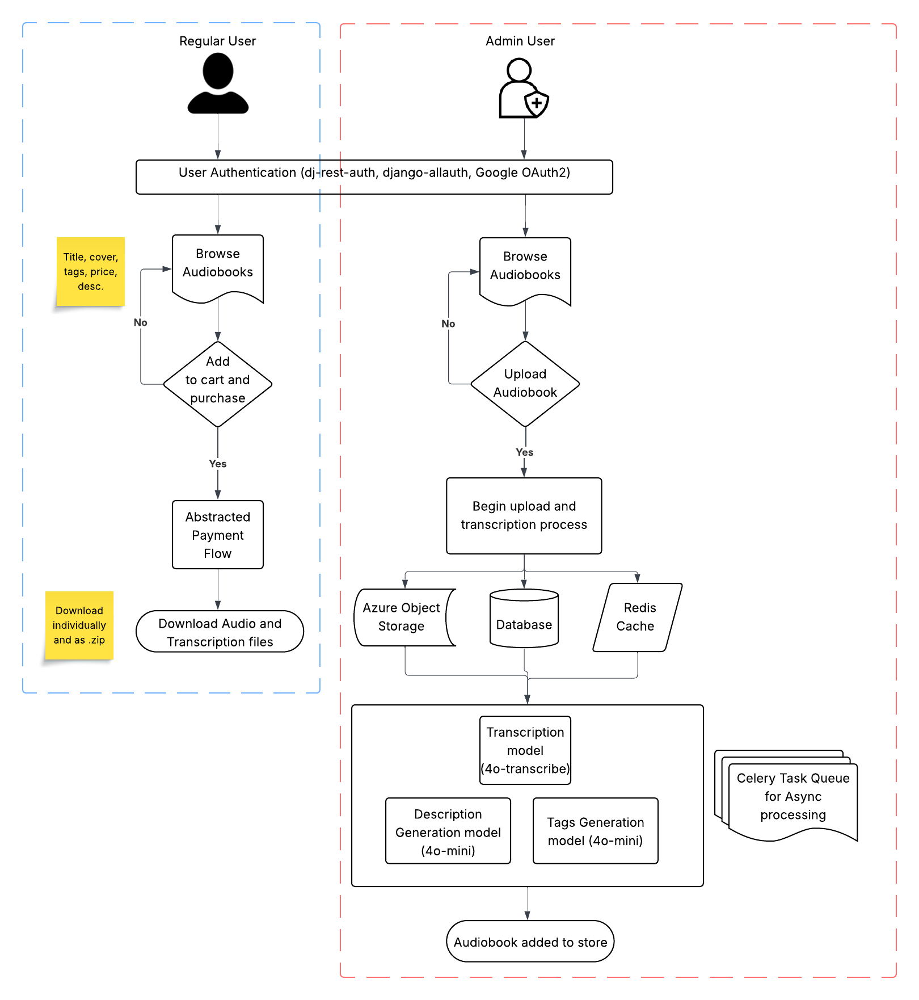
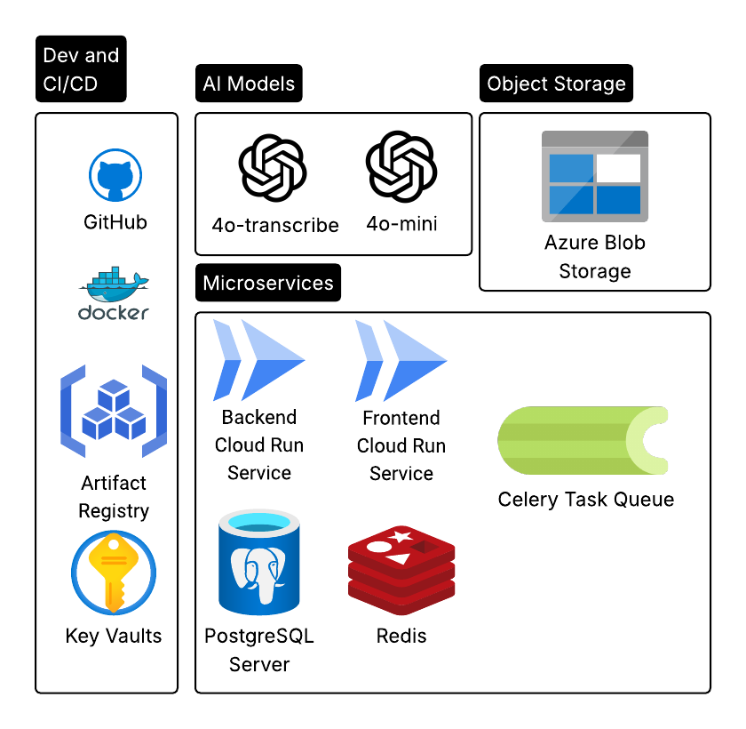
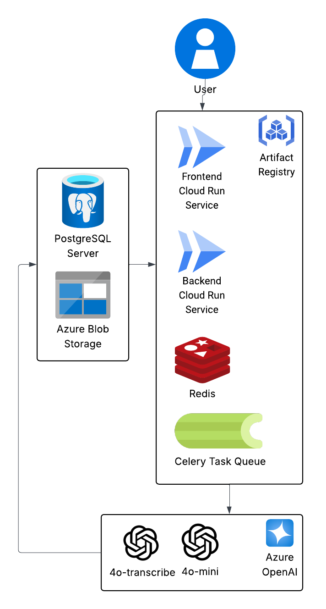

# AUDIOCITY - Audiobook App: A Full-Stack E-commerce Platform with AI Integration

This repository contains the full-stack application and infrastructure for a modern audiobook store. The platform allows users to browse and purchase audiobooks, while leveraging asynchronous AI tasks for transcription and content generation. The entire system is orchestrated using Docker Compose for a streamlined development and deployment workflow.

## AudioCity User Flow:


-----

### Key Features

  * **User Authentication**: Secure registration, login, and password reset functionalities are handled by the Django backend using `dj-rest-auth`.
  * **Google OAuth Login**: Users can easily sign in using their Google account.
  * **Audiobook Management (Admin Only)**: An admin can upload new audiobooks, which automatically triggers asynchronous AI processing.
  * **AI-Powered Transcription and Tagging**: The system uses Celery with a Redis broker to asynchronously process audio files.
      * **Transcribe Audio**: Uses a GPT-4o-transcribe model to convert audio files to text.
      * **Generate Summary & Tags**: Utilizes a GPT-4o model to create a one-paragraph summary and 3 relevant tags from the first transcribed section of the audiobook.
  * **E-commerce Workflow**: Users can add audiobooks to a shopping cart and proceed to a checkout page. Upon "purchase," they receive secure, time-limited download links for the audio files and their transcriptions.
  * **Cloud Integration**: Files are stored and managed using Azure Blob Storage, with secure SAS tokens generated for temporary download access.

-----

### Architecture and Tech Stack

The application is a full-stack project comprised of several services orchestrated with Docker Compose.

## AudioCity Services:


  * **Frontend**:

      * **Framework**: Next.js 15 with React 19. Chosen due to it's server side rendering capabilities which allows for better search rankings due to pre-rendered pages.
      * **Styling**: Tailwind CSS. For simplicity and quick time-to-prototype.
      * **Features**: Client-side cart management using `localStorage` and a ZIP download feature using `jszip` for bulk downloads.

  * **Backend**:

      * **Framework**: Django and Django REST Framework. Python chosen due to ease of AI integration and Django chosen for its 'batteries-included' modules and quick set up and very strong community support. Also has out of the box support for auth, admin panel, RestAPI, ORM, and more.
      * **Database**: PostgreSQL. Open source, free, lightweight, hugely supported.
      * **File Storage**: Azure Storage. Chosen mostly because I already have access and a lot of experience with it. This can be migrated to other Clouds or even locally.

  * **Services**:

      * **`backend`**: The main Django API service, handling web requests on port `8000`.
      * **`celery_worker`**: A dedicated service for processing asynchronous tasks.
      * **`db`**: PostgreSQL database container.
      * **`redis`**: Used as the message broker for Celery.

## AudioCity Architecture:


-----

### Getting Started

#### Prerequisites

  * Docker and Docker Compose installed.

#### Environment Configuration (ask me for the real envs)

Create a `dev.env` file in the root directory.

```
# Django Configuration
SECRET_KEY=your_secret_key
DEBUG=True

# PostgreSQL Configuration
POSTGRES_DB=your_db_name
POSTGRES_USER=your_db_user
POSTGRES_PASSWORD=your_db_password
POSTGRES_HOST=db
POSTGRES_PORT=5432

# Azure Storage Configuration
AZURE_ACCOUNT_NAME=your_azure_storage_account_name
AZURE_ACCOUNT_KEY=your_azure_storage_key
AZURE_CONTAINER=your_azure_container_name

# AI Service Endpoints
AZURE_TRANSCRIBE_ENDPOINT=https://your-azure-transcribe-endpoint.com
AZURE_TRANSCRIBE_KEY=your_azure_transcribe_key
AZURE_TRANSCRIBE_MODEL=gpt-4o-transcribe

AZURE_SUMMARIZE_ENDPOINT=https://your-azure-summarize-endpoint.com
AZURE_SUMMARIZE_KEY=your_azure-summarize-key
AZURE_SUMMARIZE_MODEL=gpt-4o-mini
```

#### Running the Application

From the root directory, run the following command to build and start all services:

```bash
docker-compose -f docker-compose-dev.yml up
```

Migrate the database structure from the backend. Inside the backend container shell, run:

```bash
python manage.py makemigrations
python manage.py migrate
python manage.py createsuperuser
```

***NOTE: Site admins must be manually added by giving them the `admin` role through the Django backend - http://localhost:8000/admin***


The backend API will be available at `http://localhost:8000`, and the frontend at `http://localhost:3000`.

To get Google Auth working, you need to set up Client ID and Client secret in the Google Cloud Console - https://developers.google.com/identity/protocols/oauth2. I show this feature working in my demo video.

-----

### Testing

The application includes automated unit tests for the backend logic.

  * **Run All Backend Tests**:
    ```bash
    python manage.py test
    ```
  * **Run Specific App Tests**:
    ```bash
    # For audiobooks tests
    python manage.py test audiobooks

    # For users tests
    python manage.py test users
    ```

### Failure Handling and Robustness
1. Audiobook file uploading:

2. AI Service Failures
   

